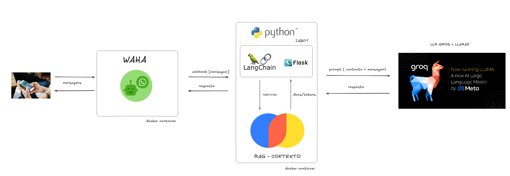

# WhatsApp AI Chatbot

Um chatbot inteligente para WhatsApp desenvolvido com Python, que utiliza modelos de inteligência artificial para fornecer respostas automáticas e interações contextuais.

## Visão Geral

Este projeto cria um chatbot para WhatsApp com capacidades de IA avançadas, permitindo automatizar atendimentos, responder perguntas de usuários e executar diversas tarefas através do WhatsApp. O bot é construído com Python e integra-se ao [waha](https://waha.devlike.pro/), oferecendo uma solução para comunicação automatizada.

## Funcionalidades

- **Conversas Alimentadas por IA**: Utiliza modelo de linguagem para gerar respostas contextuais e inteligentes
- **Integração com WhatsApp**: Conexão perfeita com Waha
- **Sistema RAG (Retrieval-Augmented Generation)**: Capacidade de buscar e utilizar informações específicas para enriquecer as respostas
- **Processamento de Mensagens**: Capacidade de receber e responder a vários formatos de mensagens
- **Armazenamento de Dados Vetoriais**: Utiliza dados em formato Chroma para melhor processamento de informações

## Stack Tecnológica

- **Python**: Linguagem principal de desenvolvimento
- **Serviços de IA**: Integração com LLMs através do langchain
- **Chroma DB**: Para armazenamento de dados vetoriais
- **Docker**: Containerização para facilitar implantação
- **Sistema RAG**: Para melhorar a qualidade e relevância das respostas

## Estrutura do Projeto

```
whatsapp-ai-chatbot/
├── bot/                  # Lógica principal do chatbot
├── chroma_data/          # Dados vetoriais para processamento de linguagem
├── rag/                  # Sistema de Retrieval-Augmented Generation
├── services/             # Serviços auxiliares e integrações
├── .dockerignore         # Arquivos ignorados pelo Docker
├── .env.example          # Exemplo de variáveis de ambiente
├── .gitignore            # Arquivos ignorados pelo Git
├── README.md             # Documentação do projeto
├── app.py                # Ponto de entrada da aplicação
├── compose.yml           # Configuração do Docker Compose
├── dockerfile            # Instruções para construção da imagem Docker
└── requirements.txt      # Dependências do projeto
```

## Instalação

### Pré-requisitos

- Python 3.8 ou superior
- Docker e Docker Compose (recomendado para implantação)
- Conta no WhatsApp 

### Passos para Instalação

1. **Clone o repositório**:
   ```bash
   git clone https://github.com/esscova/whatsapp-ai-chatbot.git
   cd whatsapp-ai-chatbot
   ```

2. **Configure as variáveis de ambiente**:

   Edite o arquivo `.env` com suas configurações específicas:
   - Chaves de API para serviços de IA

## Como Usar
### Iniciar a integração
1. **Docker**:
   ```bash
   docker-compose up -d
   ```

2. **Configurando o webhook**:
    
    Após subir os serviços no compose um webhook estará disponível em http://localhost:5000/chatbot/webhook/ e deverá ser configurado no dashboard Waha para enviar eventos de mensagens para o endpoint processar.

    *Na configuração do Waha deve-se usar o seguinte endpoint:* http://api:5000/chatbot/webhook/
   

### Conectar ao WhatsApp

O processo de conexão com o WhatsApp do Waha fornece uma session default, na dashboard podemos acessá-la e gerar o QR-CODE para conexão.

### Interagindo com o Bot

Após a conexão bem-sucedida, os usuários podem interagir com o bot enviando mensagens para o número do WhatsApp configurado. O bot processará as mensagens e responderá de acordo com sua programação e capacidades de IA.


## Workflow n8n

O arquivo `n8n_whatsapp_workflow.json` oferece um template pronto para importação no n8n. Ele registra o histórico recente das conversas, usa o ChatGPT para gerar respostas e agenda compromissos no Google Calendar.

1. Acesse o n8n e escolha **Import**.
2. Selecione o arquivo `n8n_whatsapp_workflow.json`.
3. Defina as credenciais de WhatsApp, OpenAI e Google Calendar.
4. Ative o workflow para começar a usar.

## Contribuição

Contribuições são bem-vindas! Sinta-se à vontade para:

1. Fazer fork do projeto
2. Criar uma branch para sua feature (`git checkout -b feature/nova-funcionalidade`)
3. Commit suas mudanças (`git commit -m 'Adiciona nova funcionalidade'`)
4. Push para a branch (`git push origin feature/nova-funcionalidade`)
5. Abrir um Pull Request


## Contato

Para dúvidas, sugestões ou colaborações, entre em contato através do GitHub ou abra uma issue no repositório do projeto.

[esscova](https://github.com/esscova)

